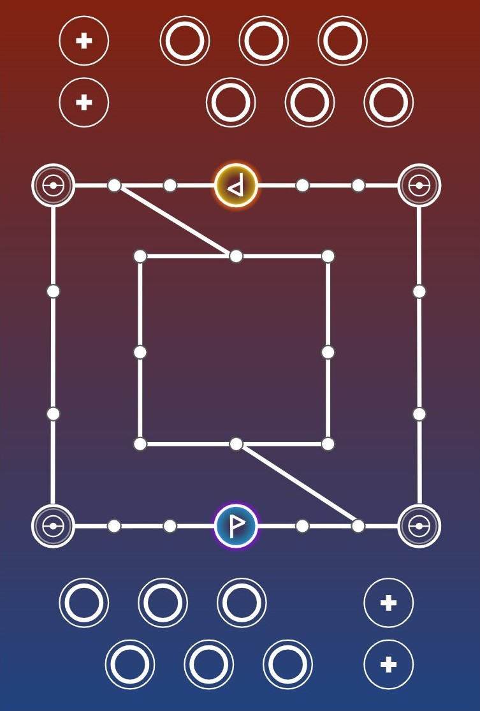
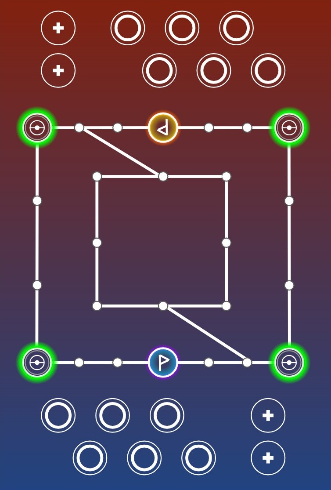
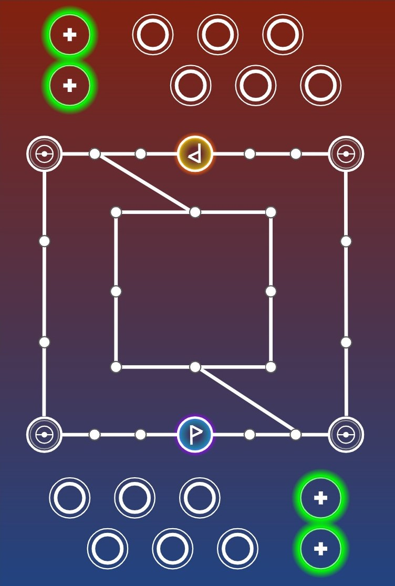

# Pokemon Duel

## Game Overview
Welcome to Pokemon Duel! Pokemon Duel is a multiplayer strategy board game with Pokemon. In this game your objective is to deploy your Pokemon figures on the game board and move them to the goal in your opponent's territory. To win the game, you have to reach your goal before your opponent reaches theirs!

Selecting the six Pokemon for your team is an important part of Pokemon Duel. Each Pokemon figure has different strengths and a set number of steps it can take, so you'll have to plan your moves strategically. You can send your Pokemon along different routes in a rush to the goal, or block your opponent's Pokemon from advancing.

When you get next to one of your opponent's Pokemon along your route, you'll need to engage in battle to advance. Battles are determined by Attacks on each Pokemon's Attack Disk. Spin the disk to see which attack each Pokémon will use. Try to knock out the opposing Pokemon or cause it to move out of your way!

## Gameplay

### Selecting Your Team
Before a match, you must select your Pokemon team. In Pokemon Duel, Pokemon figures are divided into four tiers: Common, Uncommon, Rare, and EX. Pokemon types do not matter in this game, so it shouldn't be the biggest factor you consider when assembling your team. You can find Pokemon that are good at rushing such as most of the Eevee-lutions. Then there are battlers like Pikachu or Goodra that put up a great fight. There are also defense figures, like Lairon or Meowth, that will defend your ground from intruders.

Another way to create a killer team in Pokemon Duel is by looking at figures' stats, especially Move Points (MPs). The higher a figure's MPs, the more spaces you can move on the board. This, in turn, boosts your chances of occupying your opponent's area and winning the battle. Another statistic you'll want to keep in mind is the attack ratio, which you can look at in your figures' attack disks. A Pokemon can be insanely powerful in attacking, but if their number of misses is also sky-high, it can be a warning sign to steer clear of adding them into your team.

### Attack System
Pokemon Duel has a unique attack system, and it's based entirely on colors. Where in past Pokémon games, players could choose their attacks, Pokemon Duel utilizes the spin-the-wheel randomness similar to roulette. If you choose to attack an opponent, you spin and your opponent spins, If you have the upper hand, you win and damage your opponent.

In the attack system, certain colors can beat out others similar to rock-paper-scissors. There are five colored attacks on the wheel. 
* Red attacks are a miss. 
* Blue allows you to guard yourself from an opponent's move and protects you from white and purple attacks. 
* White attacks are number-based and will beat lower numbered white and gold attacks
* Purple attacks deal status effects and will beat lower starred purple attacks and white attacks
* Gold attacks are incredibly effective and will always beat purple and blue attacks, and white attacks if the attack value is higher

#### Purple Special Effects

Some purple attacks will leave an effect on the opposing Pokemon. Here are the possible effects:
* Poison: Damage -20
* Confusion: The spun move changes in combat
* Paralyzed: Turns a random white attack into a miss
* Sleep: Can’t move or attack. Can wake up if a friendly Pokemon moves next to it or if an opponent attacks it.
* Frozen: Same as Sleep with the additional effect of turning all of a Pokemon's Attacks into Miss.
* Burned: Same as paralyzed with the additional effect of reducing the damage of a Pokemon's White and Gold Attacks by 10 in battles.

### Pokemon Evolution
In Pokemon Duel, evolutions are pretty unique. You have the choice of playing the evolved form right away or starting with the unevolved form and evolving it mid-battle. If the unevolved Pokemon beats an opponent, the Pokemon can evolve. Doing so offers a +10 damage boost on white and gold attacks and extra star on purple attacks. Evolution can make the evolved form more powerful, but it requires you to use the weaker unevolved form first.

### Ways to Win

You can beat your opponent by capturing their goal or by incurring a "Wait Win". A Wait Win occurs when the opponent runs out of time or the opponent cannot place any more Pokemon on the field. You can prevent your oppoenet from placing Pokemon on the field by blocking their Spawn Points on the game board.

Even blocking just one Spawn Point can be extremely beneficial, as it greatly limits your opponent's mobility. This makes it extremely easy to control one side of the board with no interference from the opponent's figures.

You can also send an opposing Pokemon to their Pokemon Center by surrounding your opponent. This is done by blocking each point surrounding the opponent's Pokemon.

## Terminology

### The Game Board

### Bench
The Bench is where your Pokemon sit at the start of the match. Any Pokemon on the Bench can be moved into play through the Spawn Points.

### Spawn Point(s)
These are the points on each corner of the field where your Pokemon enter the field. If these points are blocked on your side, either by yourself or by your opponent, you will not be able to move your Pokemon onto the field. If you have no Pokemon on the field and your opponent is blocking your Spawn Points, they will incur a Wait Win.

### Pokemon Center (PC)
The PC, denoted by the ‘+’ sign, is where your Pokemon go after they lose a battle. If there are already two Pokemon in the PC, the first Pokemon gets moved to the Bench and its MP is lowered to 0 for one turn. The Pokemon that lost the battle can now go in the PC. Some Pokemon have special abilities that allow them to move from the PC to the Bench instead of having another Pokemon eject them from the PC.

## Example Gameplay

## FAQs

## Version History

### Version 1.0.1

This is the first rendition of Pokemon Duel.
